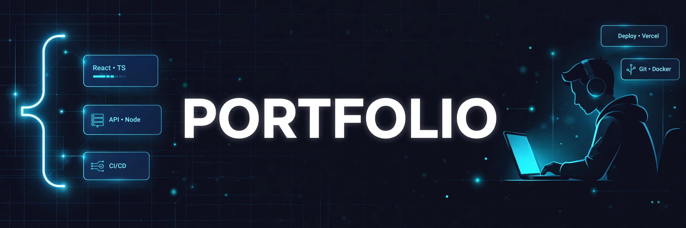

# Portfolio

> ## Status: 🟡 In Progress
>
> <progress value="85" max="100"></progress>
> **Progress: 85%** — Full portfolio site with animated pages and resume viewer; needs content polish

<p align="center">
  
</p>

[](https://react.dev/)
[](https://vite.dev/)
[](https://tailwindcss.com/)
[](https://motion.dev/)

## What it is

A personal portfolio website for a BTech Computer Science student — editorial-style design with animated page transitions. Pages: Home (hero with portrait), Work (projects), Skills, About/Contact, plus an in-browser resume viewer. Includes helper scripts that were used to generate/personalize the content from a resume PDF.

## What works (verified)

- ✅ Five routed pages with Framer Motion page transitions (verified by reading `App.jsx` routes)
- ✅ Resume viewer component + `resume_text.txt` with real resume content (verified by code read)
- ✅ Tailwind styling with custom theme (`tailwind.config.js`) (verified)
- ✅ Build scripts for content generation (`add_projects.cjs`, `personalize.mjs`, `readpdf.cjs`) — show how the site was assembled (verified by code read)

## Tech stack

| Layer | Tech |
|---|---|
| Framework | React 19 + Vite 8 |
| Routing | react-router-dom v7 |
| Styling | Tailwind CSS 3 |
| Animation | Framer Motion 12 |
| Resume parsing | pdf-parse |
| Deploy | Vercel (`vercel.json` present) |

## How to run

```bash
npm install
npm run dev      # dev server → http://localhost:5173
npm run build    # production build → dist/
```

## Screenshots

No screenshots in the repo. The banner above is the visual. The design is an editorial cream/paper aesthetic with large typography.

## What you can add more

- [ ] Remove the one-off build scripts (`add_projects.cjs`, `fix_*.cjs`, `update_*.cjs`) or move them to a `scripts/` folder — they clutter the repo root
- [ ] Delete the unused `stitch-*.html` files in `src/` (Stitch-generated drafts, not referenced by the app)
- [ ] Contact form backend — the Contact page has no submission wired up
- [ ] SEO meta tags + Open Graph image
- [ ] Blog section for writing about projects
- [ ] Lighthouse pass — the portrait image (`/front2.png`) should be optimized

## Project structure

```
src/
├── App.jsx               # Routes with page transitions
├── main.jsx              # Entry point
├── pages/                # Home, Work, Skills, About, Contact
├── components/           # Navbar, PageTransition, ResumeViewer
├── stitch-*.html         # Unused Stitch drafts (can delete)
├── convert.mjs           # Helper script
*.cjs / *.mjs (root)      # One-off content generation scripts
resume_text.txt           # Resume source content
```

---
*README written after code audit on 2026-10-08.*
